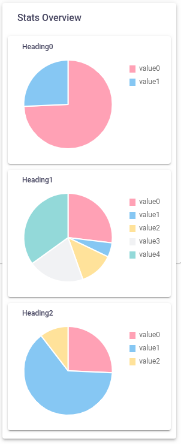

# Statistics Cards

We want to display some stat cards like below.



To make our front-end dynamic, we need to decide a response pattern from backend.
We can't just have backend spew out responses in any format it likes and expect our front-end to just somehow use all of it, at least dynamically.

In my case, I got an endpoint that had a pattern which I found to be optimal for my case:

## Backend Response Structure

```json
{
    "statCardHeading1": {
            "stat1": 100,
            "stat2": 200,
            "stat3": 300
    },
    "statCardHeading2": {
        "stat1": "value1",
        "stat2": "value2",
        "stat3": "value3",
    }
}
```

This pattern allows us to easily do the following and have the front-end recognize these changes:

- Add new stat objects
- Add new stats to existing stat objects
- Remove stats from existing stat objects
- Remove stat objects
- Modify stats e.g. key names

Takeaway: Backend response pattern should be **recognizible**. The front-end should be able to easily parse, without code modification, the response even if it applies the above modifications.

**Recognizible** does not mean we know what the values in response are, but what the response structure represents.

Examples:

- If the response adds ten stat objects, the front-end should be able to parse and understand that the response has ten stats and show ten stat cards, without requiring any code modification.

## Non Dynamic Design Pattern

Let's see an example using only one of the response objects.

```json
"statCardHeading1": {
     "stat1": 100,
     "stat2": 200,
     "stat3": 300
 }
```

### Non Dynamic Pattern Example

TypeScript

```typescript
class NonDynamicStatCardPattern {

    public ourHeading1Data: Array<number> = [];
    public ourHeading1Labels: Array<string> = ['stat1', 'stat2', 'stat3'];

    constructor() {
        this.getStats();
    }

    private getStats(): void {

        const sampleResponse: any = {
            "statCardHeading1": {
                "stat1": 100,
                "stat2": 200,
                "stat3": 300
            }
        }

        this.ourHeading1Data.push(sampleResponse.statCardHeading1.stat1);
        this.ourHeading1Data.push(sampleResponse.statCardHeading1.stat2);
        this.ourHeading1Data.push(sampleResponse.statCardHeading1.stat3);
    }

}

new NonDynamicStatCardPattern();
```

HTML

```html
<canvas
    baseChart
    [data]="ourHeading1Data"
    [labels]="ourHeading1Labels">
</canvas>
```

Now you might think what's wrong with this approach. Let's go over each issue.

1. ### Hard-coding in Labels

    ```typescript
        public ourHeading1Labels: Array<string> = ['stat1', 'stat2', 'stat3'];
    ```

    Here, we're already hard coding what the labels are supposed to be i.e. ```['stat1', 'stat2', 'stat3']```.
    This may seem like a good idea because you can set the label on front-end to whatever you want to be, but that flexibility removes the dynamic ability.

    If the database gets updated and the backend now returns a new stat object, **we'll have to modify the front-end and edit this line to add the new stat label.**

1. ### Hard-coding response key

    ```typescript
    this.ourHeading1Data.push(sampleResponse.statCardHeading1.stat1);
    this.ourHeading1Data.push(sampleResponse.statCardHeading1.stat2);
    this.ourHeading1Data.push(sampleResponse.statCardHeading1.stat3);
    ```

    Here, we're again assuming that:

      - a key `statCardHeading1` is going to exist in the response.
      - keys `'stat1', 'stat2', 'stat3'` are going to exist in the `statCardHeading1` object

## Dynamic Design Pattern

### Structure of Backend Response

Using the same response example.

```json
"statCardHeading1": {
     "stat1": 100,
     "stat2": 200,
     "stat3": 300
 }
```

- The `statCardHeading1` string will be our heading for the stats card
- The keys (`stat1`, `stat2`, `stat3`) will be our stat labels
- The values (`100`, `200`, `300`) will be our stat data

### Dynamic Pattern Example

TypeScript

```typescript
class DynamicStatCardPattern {

    public ourHeading1Data: Array<number> = [];
    public ourHeading1Labels: Array<string> = [];

    constructor() {
        this.getStats();
    }

    private getStats(): void {

        const sampleResponse: any = {
            "statCardHeading1": {
                "stat1": 100,
                "stat2": 200,
                "stat3": 300
            }
        }

        for (const iterator in sampleResponse) {
            for (const statObject in sampleResponse[iterator]) {
                this.ourHeading1Labels.push(statObject);
                this.ourHeading1Data.push(sampleResponse[iterator][statObject]);
            }
        }
    }
}

new DynamicStatCardPattern();
```

HTML

```html
<canvas
    baseChart
    [data]="ourData"
    [labels]="ourLabels">
</canvas>
```

### Things to note

1. ```typescript
    public ourLabels: Array<string> = [];
    ```

    We haven't hard-coded any of our labels.

1. ```typescript
        for (const iterator in sampleResponse) {
            for (const statObject in sampleResponse[iterator]) {
                this.ourHeading1Labels.push(statObject);
                this.ourHeading1Data.push(sampleResponse[iterator][statObject]);
            }
        }
    ```

    During parsing, we're not assuming we know the key names.

## Scaling

Suppose we now want to show three graphs. Let's see how both of these design patterns achieve this.

### Backend Response

```json
{
    "statCardHeading1": {
            "stat1": 100,
            "stat2": 200,
            "stat3": 300
    },
    "statCardHeading2": {
        "stat1": "value1",
        "stat2": "value2",
        "stat3": "value3",
    },
    "statCardHeading3": {
        "stat1": "value1",
        "stat2": "value2",
        "stat3": "value3",
    }
}
```

## Non Dynamic Pattern Scaling

TypeScript

```typescript
public parsedStatCardHeading1: {
    DATA: [],
    LABELS: ['stat1', 'stat2', 'stat3']
};

public parsedStatCardHeading2: {
    DATA: [],
    LABELS: ['stat1,', 'stat2', 'stat2']
};

public parsedStatCardHeading3: {
    DATA: [],
    LABELS: ['stat1', 'stat2', 'stat3']
};

private getStats(): void {

    const sampleResponse = {
        "statCardHeading1": {
            "stat1": 100,
            "stat2": 200,
            "stat3": 300
        },
        "statCardHeading2": {
            "stat1": "value1",
            "stat2": "value2",
            "stat3": "value3",
        },
        "statCardHeading3": {
            "stat1": "value1",
            "stat2": "value2",
            "stat3": "value3",
        }
    }

    // see where this is going?

    this.parsedStatCardHeading1.DATA.push(sampleResponse.statCardHeading1.stat1);
    this.parsedStatCardHeading2.DATA.push(sampleResponse.statCardHeading1.stat2);
    this.parsedStatCardHeading3.DATA.push(sampleResponse.statCardHeading1.stat3);

    this.parsedStatCardHeading2.DATA.push(sampleResponse.statCardHeading2.stat1);
    this.parsedStatCardHeading2.DATA.push(sampleResponse.statCardHeading2.stat2);
    this.parsedStatCardHeading2.DATA.push(sampleResponse.statCardHeading2.stat3);

    this.parsedStatCardHeading3.DATA.push(sampleResponse.statCardHeading3.stat1);
    this.parsedStatCardHeading3.DATA.push(sampleResponse.statCardHeading3.stat2);
    this.parsedStatCardHeading3.DATA.push(sampleResponse.statCardHeading3.stat3);

}
```

HTML

```html
<canvas
    [data]="parsedStatCardHeading1.DATA"
    [labels]="parsedStatCardHeading1.LABELS">
</canvas>

<canvas
    [data]="parsedStatCardHeading2.DATA"
    [labels]="parsedStatCardHeading2.LABELS">
</canvas>

<canvas
    [data]="parsedStatCardHeading3.DATA"
    [labels]="parsedStatCardHeading3.LABELS">
</canvas>
```

## Dynamic Pattern Scaling

TypeScript

```typescript
public parsedStats: any = {};

private getStats(): void {

    const sampleResponse = {
        "statCardHeading1": {
            "stat1": 100,
            "stat2": 200,
            "stat3": 300
        },
        "statCardHeading2": {
            "stat1": "value1",
            "stat2": "value2",
            "stat3": "value3",
        },
        "statCardHeading3": {
            "stat1": "value1",
            "stat2": "value2",
            "stat3": "value3",
        }
    }

    for (const statObject in sampleResponse) {

        // create an empty graph template on every stat object iteration
        const graphTemplate: any = {
            LABELS: [],
            DATA: []
        };

        for (const label of sampleResponse[statObject]) {
            graphTemplate.LABELS.push(label);
            graphTemplate.DATA.push(sampleResponse[statObject][label]);
        }

        this.parsedStats[statObject] = graphTemplate;
    }

}
```

HTML

```html
<canvas
    *ngFor="let statObject of parsedStats"
    [data]="statObject.DATA"
    [labels]="statObject.LABELS">
</canvas>
```

Now even if the backend adds more stat objects, front-end will be able to parse the response and show those stats in the stat card
**without code modification in either HTML or TS code.**
